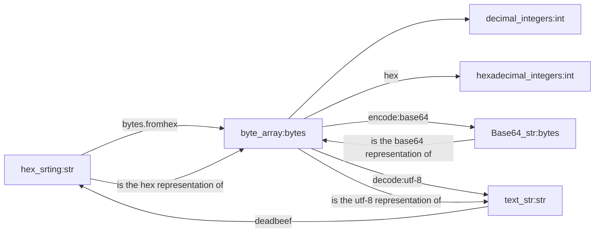

# readme

## 倪浚桐

## 202022161224

## Lab1

## macOS Big Sur 11.5.2(20G95)

## Pycharm 11.0.11 x86-64

## Python 3.9.5




```python
byte_array = bytes.fromhex(hex_string)
```

```python
def bytes_to_dec(in_bytes: bytes) -> None:
    print("decimal integers:", end=' ')
    for b in in_bytes:
        print(b, end=' ')
    print()
```

```python
def bytes_to_hex(in_bytes: bytes) -> None:
    print("hexadecimal integers:", end=' ')
    for b in in_bytes:
        print(hex(b), end=' ')
    print()
```

```python
def encode_base64(in_bytes: bytes) -> None:
    print("Base64_str:", end=' ')
    print(base64.b64encode(in_bytes))
```

```python
def decode_utf8(in_bytes: bytes) -> str:
    print("text_str:", end=' ')
    return in_bytes.decode('utf-8')
```


